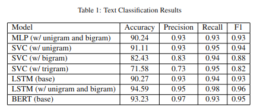

# Overview
This repository contains the code and final report submitted as part of the final project for my CS7650 Natural Language Processing class at Georgia Tech. The project, completed by myself and my classmate Jongseok Han, had two primary objectives:
1. Train a classifier that can discriminate between posts made by depressed and non-depressed users of the content sharing platform Reddit
2. Identify common keywords/topics discussed in posts made by depressed users

# Results
We trained a total of seven classifiers with varying architectures and feature sets, with the highest performing model being an LSTM model using unigram and bigram features. The full results are detailed in Table 1.

